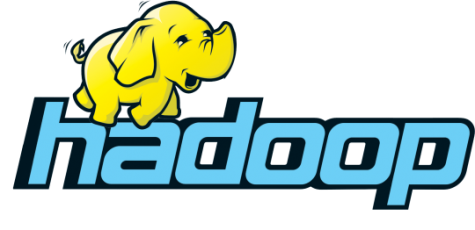

# 認識開發環境：Hadoop與Hive

### Hadoop

Hadoop是一個分佈式計算的基礎架構，因具備高可靠、高拓展、高容錯、低成本的特點，成為目前最流行的大數據分析系統**。**是Doug Cutting根據Google發布的學術論文而創建的開源項目，根據官方的定義是：

> The Apache Hadoop software library is a framework that allows for the distributed processing of large data sets across clusters of computers using simple programming models. It is designed to scale up from single servers to thousands of machines, each offering local computation and storage. Rather than rely on hardware to deliver high-availability, the library itself is designed to detect and handle failures at the application layer, so delivering a highly-available service on top of a cluster of computers, each of which may be prone to failures.

大數據技術實際上是起源於搜索引擎技術的，任何搜索引擎都會面臨的幾個難題

1. 當我們輸入關鍵字，然後點擊搜索的時候，google 為什麼能在很短的時間內檢索數十億的網頁，返回我們想要的結果呢？
2. 搜索返回的結果有很多條，它們又是按照什麼規則排序的呢？

這兩個問題，就是涉及數據的儲存及計算，針對如上問題，Google在2004年前後發表了三篇論文—Google File System、MapReduce以及Bigtable。

GFS解決了數據大規模存儲的問題，讓數據可以幾乎無限的增長下去； MapReduce解決了數據大規模計算的問題，讓大規模數據處理成為可能，Google這三篇論文也就是Hadoop的思想來源，正是Google的解決方案才成就了今天的Hadoop。

***

Hadoop由**HDFS**、**YARN**及**MapReduce**三個核心項目組成，但Hadoop雖然解決了最核心的問題，但不是所有的問題，例如如何將數據導入到Hadoop中，如何以更簡單的方式使用Hadoop，如何處理實時的數據以及如何以更廉價高效的方式存儲數據等等。

圍繞著這些問題，從而形成了Hadoop的技術生態。

### **MapReduce**

**Hive**也是Hadoop生態裡的項目。我們重點來理解MapReduce跟Hive。

在MapReduce計算框架中，一個Job被分成Map和Reduce兩個計算階段。其功能是將單個任務/數據集打碎，並把碎片任務發送(Map)到多個節點上運算，之後再將單個數據集進行合併、排序等處理，加載(Reduce)到數據倉庫。

從處理流程，我們也可以了解為什麼hadoop具備低成本、高拓展的特性。假設我們想要增加運算能力，不必購買昂貴的超級計算機，只需要多添購幾台一般的機器(物理機)，就可以達到拓展集群運算能力的目的。

### Hive

> The Apache Hive data warehouse software facilitates reading, writing, and managing large datasets residing in distributed storage and queried using SQL syntax。

因為MapReduce的程式寫起來太麻煩，於是有了Hive。Hive 最初是由FaceBook開發的一個基於 Hadoop 框架並且開源的一個數據倉庫工具，提供了數據提取、轉換、加載功能，並提供了簡單的類SQL査詢語言，稱為**HQL**。

如此一來，讓熟悉SQL但不會編程MapReduce程序的人，也能使用Hadoop進行處理數據。白話來說，就是Hive會自動將 SQL语句通過解釋器轉換為 MapReduce任務運行。

> 大數據動物園
>
> * Hadoop創始人Doug Cutting的兒子經常將自己的黃色玩具大象叫做"Hadoop"，Cutting便將自己的大數據項目以此來命名。
> * Doug Cutting後來加入了雅虎，並在雅虎期間支持了大量Hadoop的研發，因此Hadoop也經常被認為是雅虎開源的大數據框架
> * 繼Hadoop之後，很多大數據框架相繼使用動物的名字來命名，例如Hive是蜜蜂、Flink是一隻紅色松鼠、Impala是非洲的羚羊...(有興趣的同學可Google "Hadoop Ecosystem logo")

